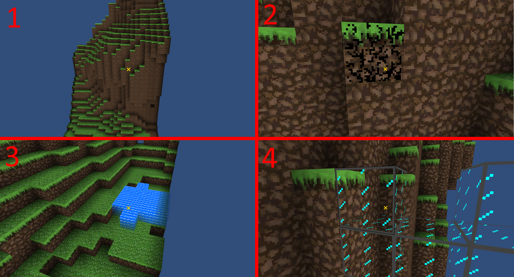

# VoxelPrototype

This started as a short experiment with Minecraft-like voxel worlds in the Unity game engine but grew to unforeseen complexity and it's now mostly spaghetti code. 
Oops. 

## Notice

Binary assets are omitted from this repo, so the project won't open correctly. 
Consider this repo to be code-only and not a fully functional Unity project.

## Features

List of things I learned:
* Partially optimized (but still naive) mesh generation
* Voxel physics - specialized raycasting & player-voxel collider
* 2d texture array shader
* Transparent texture shader
* Visual block highlighting (built into the shaders)
* Visual block damage progression (built into the shaders)
* Per-vertex lighting w/ natural sunlight propagation and support for additional light sources
* Fluid blocks with propagation (partially implemented, still buggy - I moved on to another project here)

## Screenshot

|  |
|:--:|
| Image: Collage of 4 screenshots: 1. Per-vertex lighting on textured voxels 2. Block highlighting and damage progression 3. Fluid propagation 4. Transparent glass block rendering | 

## Credits

A lot of different code samples were cobbled together from many different places online. 
Some particularly useful resources I found and borrowed from:
* https://0fps.net/2012/01/14/an-analysis-of-minecraft-like-engines/
* https://forum.unity.com/threads/after-playing-minecraft.63149/
* ~~https://www.sea-of-memes.com/~~
    * Looks like this domain has been hijacked. Was a really cool blog chronicling the development of an amazing voxel engine.
* https://bitbucket.org/volumesoffun/polyvox/src/9a71004b1e72d6cf92c41da8995e21b652e6b836/include/PolyVox/Raycast.inl?at=develop&fileviewer=file-view-default
* https://accidentalnoise.sourceforge.net/minecraftworlds.html
* Many, many more
